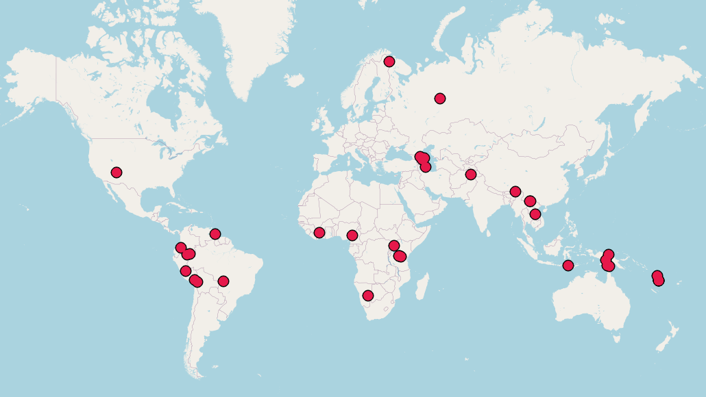

The following map shows the languages where people are currently preparing text collections for submission. Colors will be used to show the progress of the collections as they being reviewed, accepted, and published.

All published collections will be available at [our Zenodo community](https://zenodo.org/communities/otc).

The following table shows how many collections are found at the various stages in the different regions. Once a collection is published, the dot will be replaced by the actual language name.

<!--<table id="collection_overviewx">
<thead>
<tr><th>Area</th><th>expression of interest</th><th>submitted</th><th>rejected</th><th>accepted</th><th>published</th></tr>
</thead>
<tbody>
<tr><td>Africa       </td><td>⬤⬤⬤     </td><td>    </td><td>    </td><td>    </td><td>    </td></tr>
<tr><td>Caucasus     </td><td>⬤⬤⬤⬤⬤⬤⬤⬤</td><td>    </td><td>    </td><td>    </td><td>    </td></tr>
<tr><td>Eurasia      </td><td>⬤⬤⬤     </td><td>⬤   </td><td>    </td><td>    </td><td>    </td></tr>
<tr><td>Papunesia    </td><td>⬤⬤⬤⬤⬤⬤  </td><td>⬤   </td><td>    </td><td>    </td><td>    </td></tr>
<tr><td>South America</td><td>⬤⬤⬤⬤⬤⬤⬤ </td><td>⬤   </td><td>    </td><td>    </td><td>    </td></tr>
</tbody>
</table>-->

<table id="collection_overview">
    <thead>
        <tr>
            <th>Area</th>
            <th>expression of interest</th>
            <th>submitted</th>
            <th>rejected</th>
            <th>accepted</th>
            <th>published</th>
        </tr>
    </thead>
    <tbody>
        
            <tr>
                <td>{{ area[0] }}</td>
                    
                    <td>
                        
                        {{ status[1] }}
                            
                                {{ lg }}
                                                        
                                ⬤
                            
                        
                    </td>
                    
            </tr>
        
    </tbody>
</table>

Information current as of 2024-03-14

