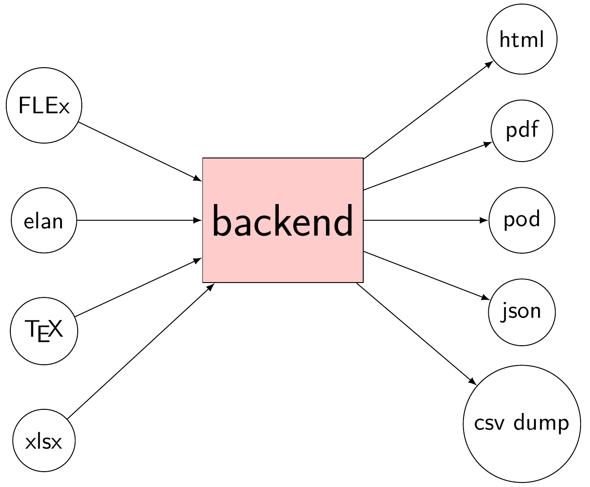

# Tools

Our text collections make use of the [CLDF framework](https://cldf.clld.org). We provide import routines for a variety of formats (ELAN, FLEx, tex, ...) and we provide a variety of exports. The following chart illustrates this.

As the project progresses we will make available the different conversion routines as python libraries as well as as web services.

- eaf2cldf: based on [eldpy](https://github.com/ZAS-QUEST/eldpy)
- flex2cldf: based on [cldflex](https://github.com/fmatter/cldflex)
- tex2cldf: based on [linglit](https://github.com/cldf/linglit)
- xlsx2cldf: to be developed

- cldf2json
    - json can then be imported into ElasticSearch, as is done in [IMTVault](https://imtvault.org), to be viewed as HTML in the browser
- cldf2gb4e to generate pdfs via LaTeX
    - print-on-demand books via BoD based on these pdfs.

